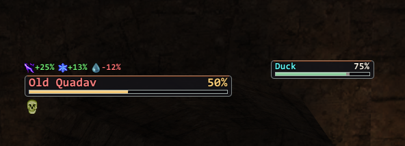

# enemybar (Ashita v4)

<!-- staff-approval -->
## Approval by staff

| Version | Status | Submitted | Reviewed by | Notes |
|---|---|---|---|---|
| 1.5.1 | Pending review | 2026-10-02 | | Display only, sends nothing. Distance display off by default (enemybar2 condition). |

**Author:** mmckee and akaden (enemybar2, BSD 3-Clause); XIUI authors (debuff tracking, GPL-3.0); Ashita port by Spongeh. **Program:** Ashita v4. **Type:** display only. Enemy HP bars with buff and debuff timers; it never sends anything to the server.
<!-- /staff-approval -->

---

Big enemy HP bars in the style of Windower's **enemybar2**, plus buff and debuff tracking
from **XIUI**. Every bar is its own window that you can place anywhere.

## Screenshots

*Farplane IX style: the target bar with its weaknesses and resistances above it and its debuffs below, and a party member's bar on the right.*

## Bars

| Bar | Shows |
|---|---|
| **Target** | Your current target |
| **Target of Target** | Who your target is attacking. For players, their own target. For mobs, the last thing they acted on, then who they're facing. |
| **Sub-target** | The `<st>` cursor while you're choosing a target |
| **Focus** | A mob you pin with `/eb ft <name>`. It stays up while you target other things. |
| **Aggro Stack** | Every mob engaged with your party, lowest HP first. Slept, petrified or terrorized mobs drop to the bottom. Off by default. |

Each bar can show:
- **Name and HP%** inside the bar.
- **Distance** on the left (off by default; PhoenixXI approves enemybar2 with distance display off).
- **The spell or TP move being readied**, above the bar, with a progress line.
- **A marker** when that mob is your target or sub-target.
- **Target-of-target** as an arrow and name beside the bar.
- **Weaknesses, resistances and immunities** above the bar, read from your installed
  **MobDB** with its icons: green `+25%` means the mob takes more damage from that weapon
  type or element, red `-50%` means less. Status immunities follow. Hover an icon for
  details. This is on for Target and Focus by default and needs MobDB in `addons/mobdb`.
- **Buff and debuff icons with countdown timers**, below or to the right. A yellow **?**
  marks a debuff that was inferred rather than confirmed, such as a weapon skill's
  secondary effect.

## Farplane IX style (default)

Every bar defaults to **Farplane IX**, Final Fantasy IX's battle window in Farplane colors. It
matches XivParty's farplane9 layout.

- A smoky charcoal plate with a misty border and an ember hairline on top.
- The name on the left, in its claim color, and HP% on the right. HP% is ivory, then turns
  amber, orange and red as HP drops.
- A framed gauge underneath that shifts from green to amber to orange to red. After a hit, a
  pale trail marks the HP just lost, then catches up after a moment.

The plate's height follows the bar's font size. **Bar style** on each bar's tab switches between
Farplane IX, Bar, EKG monitor and Zelda hearts. **Use this style on every bar** applies the current
bar's style to all of them.

## EKG monitor style

Any bar can be a **Resident Evil condition monitor**: open `/eb`, pick the bar's tab, and set **Bar style** to **EKG monitor**
(**Monitor height** sets its size).

- A heartbeat trace sweeps across a dark scanlined panel, with a glowing head and a fading tail.
- The trace is green (**Fine**, 60% HP and up), turns yellow and orange (**Caution**), then red
  (**Danger**, under 25%).
- The heart rate rises as HP drops, from about 60 BPM at full HP to about 180 near death. In
  Danger the rhythm turns irregular and jittery.
- The panel border flashes on each beat, and a thin strip along the bottom shows HP. A dead mob
  flatlines.

## Zelda hearts style

Set **Bar style** to **Zelda hearts** on any bar's tab and HP becomes a row of pixel-art heart
containers.

- There are 10 hearts by default, each an equal share of HP. They empty a half at a time,
  rounded up, so a mob with any HP left keeps at least half a heart.
- A half that is lost flashes white and fades.
- When HP is low, the last heart throbs, like Zelda's low-health warning.
- When HP goes up, from regen, a cure or anything else, a wave rolls left to right across the
  hearts: each one bobs up and glints a moment after the one before. While the mob shows a
  Regen effect, a gentle wave also repeats every few seconds.
- **Hearts**, **Hearts per row** and **Heart size** set the layout. The art scales in whole
  steps (22 = 2x, 33 = 3x) so it stays crisp. The name and HP% sit under the hearts, with the
  status icons below them.

## Theme

`/eb` -> General -> **Window theme** colors the settings window and the icon tooltips:
**Phoenix** (ember red, the default), **Farplane** (Final Fantasy X ember and mist), **Farplane9** (Farplane colors in a squared FF9 style; the default), **Umbrella**
(Resident Evil green), **Midnight** (blue) or **Classic** (stock ImGui). `/eb theme <name>` does
the same. The bars keep their own colors.

## Colors

- **Fill color:** every bar has its own color picker.
- **Color by claim state** (per bar): changes the fill to match the claim, with its own
  palette for each bar. The states are unclaimed, claimed by you or your party, claimed by
  your alliance, claimed by others, party member or pet, other player, NPC, and dead.
- **Name text color** follows the claim state, using enemybar2's colors. You can change these
  in the General tab.

## Setup

1. `/addon load enemybar`
2. `/eb` opens the settings window.
3. Turn on **Setup mode**. Every bar appears with demo data, and you can drag each one
   wherever you want. Hold **Ctrl** while releasing to snap to a 10-pixel grid.
4. Turn setup mode off. The bars stay where you left them, saved per character.

If you also run XIUI, you may want to turn off XIUI's own target bar so the two don't
overlap.

## Commands

| Command | |
|---|---|
| `/eb` | open or close the settings window |
| `/eb setup [on\|off]` | setup mode: demo bars you can drag |
| `/eb ft [name\|id\|clear]` | focus target. With no argument it uses your current target. |
| `/eb show <bar>` / `/eb hide <bar>` | `target`, `tot`, `subtarget`, `focus` or `aggro` |
| `/eb reset` | move every bar back to its default position |
| `/eb theme <name>` | settings window theme: Phoenix, Farplane, Umbrella, Midnight, Classic |

## Debuff durations

Durations come from XIUI's standard (LandSandBoat) tables, which suit PhoenixXI and other
LSB servers. Timers start when the server reports that the effect landed, and they clear
when it wears off, when the mob dies, or when you zone. Debuffs are tracked from what
**your client sees**, so effects that landed before you arrived, or out of range, won't
appear.

## Credits and license

- **enemybar2** by mmckee and akaden: BSD 3-Clause.
- **XIUI** by tirem and contributors: GPL-3.0.
- **Ashita port** by Spongeh.

This addon is distributed under GPL-3.0. See `NOTICE.md` for details and changes.

<!-- for-reviewers -->
## For reviewers

### Relationship to approved addons

This is an Ashita v4 port of **enemybar2**, which is approved for Windower **with distance
display off**. Here the distance display is **off by default**, and a one-time update turns it off
for existing settings. It's still a per-bar option in `/eb`, so staff can require it locked off.

Buff and debuff tracking comes from **XIUI**, which is approved for Ashita.

### What it reads

**Incoming packets.** It only listens; the packets are never changed or blocked.

| Packet | Used for |
|---|---|
| 0x028 (action) | which mob is acting on whom (target of target), spells and TP moves being readied, debuffs landing |
| 0x029 (battle message) | debuffs wearing off, resists, interrupted casts |
| 0x00E (NPC/mob update) | the entity cache used by the debuff tracker |
| 0x00A / 0x00B (zone in / out) | clearing all tracked state when you zone |
| 0x0DD (party member update) | refreshing the party list (to tell party and alliance claims apart) |
| 0x08C / 0x08D (merits / job points) | your own merits that lengthen debuff durations (from XIUI) |

**Client memory, through Ashita's API:**
- entities you can already see: name, HP %, distance, claim id and status;
- your target and sub-target;
- party and alliance member ids and names.

**Files:** if MobDB is installed in `addons/mobdb`, it reads MobDB's own per-zone data files
(read only) to show weaknesses and immunities. Icons come from its own `assets` folder.

### What it writes

- **Its own settings file,** through Ashita's settings library.
- **Chat:** text to your own chat log, only from its `/eb` commands.

### What it does NOT do

- **No outgoing packets.** It has no `AddOutgoingPacket` call or any other packet injection.
- **No commands:** no `QueueCommand`, no targeting, and no automated actions. `e.blocked` is
  used only to consume its own `/eb` command.
- **No changes to incoming data.** No incoming packets are modified, blocked or injected.
- **No network access.** File access is limited to its settings, its own assets and MobDB's data
  files (read only).
- **No hidden information:** it shows only what your client already receives, the same data
  XIUI's target bar uses.

### Files in the reviewed version

`SHA256SUMS` lists the SHA-256 of every file in this version (673 files). The README's images in `screenshots/` aren't part of the addon and aren't listed.
Its own SHA-256 is `006191a5f42bf04a0de6556fcd0ad5beba8eb976b125db108bbffc8c7081cd52`.

Main files:

| File | SHA-256 |
|---|---|
| `enemybar.lua` | `388efe201f0aedd4a0342e1ab2763e90542caa0f8eb80403de1c61473ad4fb5f` |
| `eb/render.lua` | `d54513aef634a3ae28c0023fdb46f0af31d978d0e328008cb38e715f47529840` |
| `eb/tracker.lua` | `7b77c7f6bdc260fb6773bf5609e052bbc68c9d7418f78681e7bdc64d1024d96b` |
| `eb/resists.lua` | `fbef96bcffaff5b7f735f19b6b3324a39ecc121efc857cd6f9fe5bbcf61beef5` |
| `eb/configui.lua` | `69620ca2bbfe9f67144071bd23a9c749e96e0ef234d21b198ced136f558cfc19` |
| `eb/defaults.lua` | `e656e1587ca5233d1206687716c234a5138693837ff6830229a2afdd8ecf34fe` |
| `eb/ekg.lua` | `f30bd583e90fc792cd612679c4e34d4336a33e58eb3ede22f0d7f662dea030b1` |
| `eb/hearts.lua` | `841cdedc93e701e63312abbc49773b2a3037c56c839b8c3feb4f4e5d3d7ec4a7` |
| `eb/ff9.lua` | `f709c4a2c1d093112cf9278c2eae7755cfc64ffbdc1a62e20c1e592aa8fc75a1` |
| `eb/util.lua` | `9c1035d89072544e07723d972a77d44143deb29ef358184df99abb4923053e0c` |
| `phxui.lua` | `807bae19ddfb7b541589c2baf008fa384689d79c25bdc4befcf8a1845a8c7a72` |
| `handlers/debuffhandler.lua` | `f1a0db3d43ec253f9a22d93d26b2eb57b2187e0908f2b870512200f690c26abd` |
| `handlers/enemycasts.lua` | `72e2bbdb5eb2304299697a4f9ae08783dbe01c0016f72e90a9388dd3475de4a0` |
| `handlers/actiontracker.lua` | `b5b1c3655d05ee9ec941ebfecd571babebedb09d8416ceeff41874b4b97ce0ec` |
| `handlers/statushandler.lua` | `ab563d181d4662126b3dad009a6dfaca3902a316f35ea0cd895f526d08e0aba5` |
| `libs/packets.lua` | `8f0aeb20bc892caa5306d789ddc56d3b80fc0240a9f6493e588cc6b57e9bf84b` |
