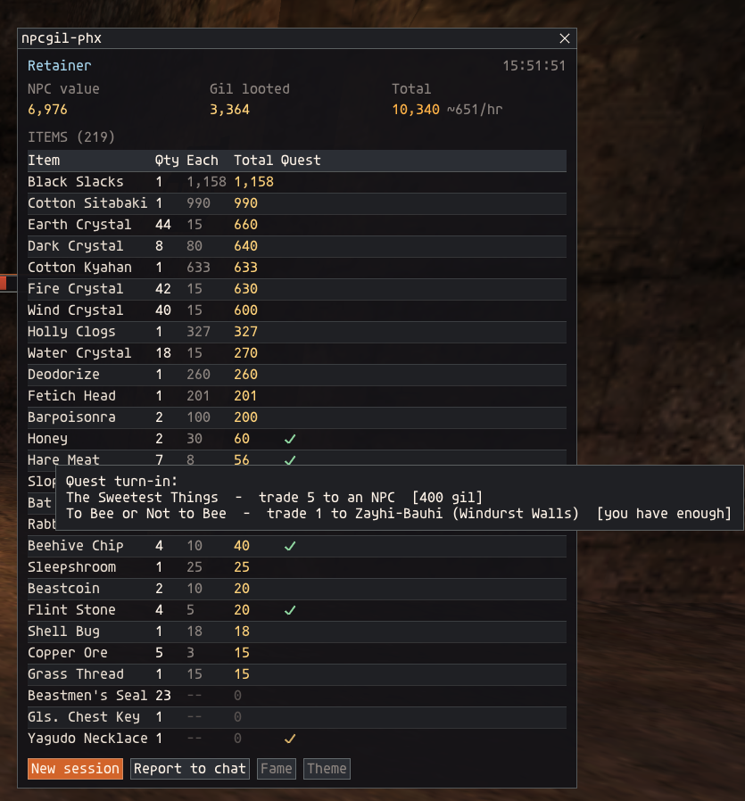

# npcgil-phx (Ashita v4, PhoenixXI)

<!-- staff-approval -->
## Approval by staff

| Version | Status | Submitted | Reviewed by | Notes |
|---|---|---|---|---|
| 2.3.0 | Pending review | 2026-10-02 | | Display only, sends nothing. Replaces 2.2.1 and 2.2.2, which were never reviewed. Adds quest turn-ins and a theme button. |

**Author:** Spongeh. **Program:** Ashita v4. **Type:** display only. It reads data the client already receives and never sends anything to the server.
<!-- /staff-approval -->

---

A small farming-session tracker. It tallies the items you win from treasure pools, values them
at what an NPC pays you for your fame, flags the ones a quest takes as a turn-in, and adds the
gil you loot from kills. It doesn't automate, target, move, trade, sell or buy anything.

`/addon load npcgil_phx`

## Screenshots



*A farming session: items won with their NPC value, gil looted, the total and gil per hour. Hovering a check in the Quest column lists the quests that take the item.*

## What it counts

- **Items you win from the treasure pool**, meaning mob drops and anything else that goes through
  the pool. Items you buy, trade, steal, move between bags, or win while your inventory is full
  aren't counted.
- **Gil looted from kills** (mostly beastmen): your share from each "obtains gil" message, with
  the number of kills.
- Only your own winnings. Everyone who runs the addon tracks their own.

## Window

- Each item with its quantity, price each, and total, highest value first, and a **Quest**
  column (see below).
- **NPC value**, **Gil looted** and a combined **Total**, with gil per hour after the first
  minute. Items NPCs won't buy show `--`.
- **New session** (click twice to confirm), **Report to chat**, **Fame** and **Theme**.
- The session timer only runs while you're logged in. The session is saved per character, so
  reloading or relogging keeps your tally.

## Fame

Open **Fame** and set your fame level (1-9, or maxed) for San d'Oria, Bastok, Windurst and
Norg. Items are valued at the best-paying shop for that fame, and the window shows where that
is. Fame levels are saved per character and kept when you start a new session.

PhoenixXI's rules (`scripts/globals/shop.lua`):

- A shop pays `base price x (price rank + 389) / 400`. The price rank runs from 1 to 21 and
  comes from your fame in the shop's area.
- Jeuno shops always use rank 11, the full base price. With little fame, Jeuno is the best
  place to sell.
- Nation and Norg shops pay up to 2.5% more once your fame there is high. Fame with one nation
  lowers your rank with the other two nations' shops.
- Fame is stored as points from 0 to 2500. PhoenixXI uses the pre-2014 thresholds: level 2 at
  200, 3 at 500, 4 at 900, 5 at 1300, 6 at 1700, 7 at 1950, 8 at 2200 and 9 at 2450. Each level
  counts as the points where it starts, and "9 (maxed)" is 2500.

## Quest turn-ins

Items that a quest takes as a turn-in get a check in the **Quest** column. Hover it to see which
quest, who takes the item and where, how many, the gil reward, and whether the quest can be
repeated. The check turns green once you have enough for a turn-in. For example, Rabbit Hide:

> The Merchants Bidding - trade 3 to Parvipon (Southern San d'Oria) [120 gil, repeatable]

**Report to chat** lists the same quests under each item.

The list (`data/quest_items.lua`) is built from PhoenixXI's public server scripts, so it covers
the quests the server actually codes:
- quest scripts (`scripts/quests/`): the NPC's trade check, its gil reward, and whether the
  trade still works after the quest is done (repeatable);
- older NPC scripts (`scripts/zones/<zone>/npcs/`): a trade check next to the quest it belongs
  to. These don't say whether they repeat.

Quests from after Treasures of Aht Urhgan (Crystal War, Abyssea, Adoulin, Coalition and the [S]
zones) are left out. Gil is the largest gil amount in that quest's script, so for quests with
several rewards it's the best case. Some quests take an item only as one of several choices.

## Theme

Click **Theme** (or right-click the window) to pick a theme: Phoenix (ember red), Farplane (Final Fantasy X ember and
mist), Farplane9 (Farplane colors in a squared FF9 style; the default), Umbrella (Resident Evil
green), Midnight (blue) or Classic (stock ImGui). The choice is saved per character.

## Commands

| Command | |
|---|---|
| `/npcgil` or `/ngp` | show or hide the window |
| `/npcgil show` / `hide` | |
| `/npcgil reset` | start a new session |
| `/npcgil report` | print the session, with quest turn-ins, to your own chat log |
| `/npcgil theme <name>` | window theme: Phoenix, Farplane, Farplane9, Umbrella, Midnight, Classic (or right-click the window) |

<!-- for-reviewers -->
## For reviewers

### What it reads

**Incoming packets.** It only listens; the packets are never changed or blocked.

| Packet | Used for |
|---|---|
| 0x0D2 (item added to the treasure pool) | remembers which item is in which pool slot |
| 0x0D3 (lot result) | counts an item only when the result is "won" by your own character |
| 0x029 (battle message) with message 565 ("obtains gil") | adds your own share of gil from a kill |
| 0x00A (zone in) | clears the remembered pool when you change zones |

**Client memory and resources, through Ashita's API:**
- your own party slot: your server id (to recognise your own wins) and name (shown in the window
  header);
- item names from the client's resource data.

### What it writes

- Its own settings file, through Ashita's settings library: the session tally, session time, fame
  levels you typed in, and window theme.
- Text to your own chat log, but only when you click **Report to chat** or use `/npcgil report`.
  It isn't sent to any chat channel.

### What it does NOT do

- **No outgoing packets.** It has no `AddOutgoingPacket` call or any other packet injection.
- **No commands.** No `QueueCommand` or automated chat or actions.
- **No changes to incoming data.** No incoming packets are modified, blocked or injected.
- **No network or file access** beyond Ashita's settings file. No sockets, HTTP or external
  programs.
- **No access** to other players' data beyond what the treasure-pool and battle packets already
  show in your own log.

### Data tables

Both are fixed tables generated from PhoenixXI's public server repository. Nothing is looked up
at run time.

- `data/prices.lua`: base NPC sell prices from `sql/item_basic.sql` plus the module SQL in
  `modules/init.txt` (Phoenix's pre-RMT vendor price reverts). The fame levels you type in only
  change the displayed estimate.
- `data/quest_items.lua` (new in 2.3.0): which quests take an item as a turn-in, read from the
  trade checks in `scripts/quests/` and `scripts/zones/*/npcs/`, with the NPC, zone, quantity,
  gil reward and whether it repeats. It is only shown in the window's tooltip and the chat report.

To rebuild them:

```
git clone -b live https://github.com/phoenixffxi/Phoenix phoenix
python tools/build_prices.py phoenix
python tools/build_quest_items.py phoenix
```

### Changes since 2.2.2

- `session.lua`: Quest column with a hover tooltip, quest lines in the chat report, a Theme
  button next to Fame.
- `data/quest_items.lua` and `tools/build_quest_items.py`: new.
- `npcgil_phx.lua`: version and description.

### Files in the reviewed version

`SHA256SUMS` lists the SHA-256 of every file in this version (8 files). The README's images in `screenshots/` aren't part of the addon and aren't listed.
Its own SHA-256 is `02eb88fd16a34d0bf39f29e9fffd918d93c9e791b191b34b777e77716509a3de`.

Main files:

| File | SHA-256 |
|---|---|
| `npcgil_phx.lua` | `830453d0a77f146ddbb2aa83dfbe25f82a510977933a9410a4fae5f6609fb230` |
| `session.lua` | `cc05d71908c20c53747c6f61fde476220f712fc2c527cd5b44d31447d05cc529` |
| `fame.lua` | `ee5b1a2b96c97edb43a24a6bf689f9c75cbffe4d18bf6f79a4b9caf02199976b` |
| `phxui.lua` | `807bae19ddfb7b541589c2baf008fa384689d79c25bdc4befcf8a1845a8c7a72` |
| `data/prices.lua` | `fb408ff45bd9b98bb8157ea82c20b0307e4f464bdfbb2fcaa51c7f6fe7dff24e` |
| `data/quest_items.lua` | `c94a6a3f14de75320cacec38419cecf4732d4aedea7fa54a878bca32cc0db5da` |
| `tools/build_prices.py` | `668ef7411c2496ec3d0dd44c4fce4e413f3dc15aecaef08dbb18de56fa0ed141` |
| `tools/build_quest_items.py` | `bc260bf41beda66814075b6b33876e6323f95832628f12a854134a06fb0c1fa4` |
