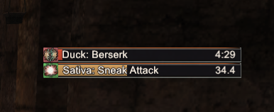
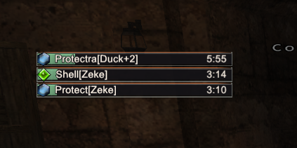

# tTimers

<!-- staff-approval -->
## Approval by staff

| Version | Status | Submitted | Reviewed by | Notes |
|---|---|---|---|---|
| 0.25-party.5 | Pending review | 2026-10-02 | | Fork of approved tTimers 0.25. Adds party job ability recasts, a theme and a skin. |

**Author:** Thorny (tTimers, MIT); party tracker, theme and Farplane IX skin by Spongeh. **Program:** Ashita v4. **Type:** display only: timer panels. It is a fork of tTimers 0.25, which is approved.
<!-- /staff-approval -->

---

Displays time remaining on buffs and debuffs you've cast, as well as the recast timers for your spells and abilities.

## Screenshots



*Party job ability recasts (added in this fork).*



*Buffs on you, with who cast them, in the Farplane IX skin.*

## Installation
Download the release zip(**on the right sidebar, do not click code..download as zip**). Extract directly to your Ashita directory(the folder with ashita-cli.exe in it!). Everything should fall into place. Load the addon with **/addon load tTimers**.

## Commands

**/tt**<br>
Opens configuration menu.  This allows you to change themes, alter behavior, etc.

**/tt reposition**<br>
Forces all timer panels visible with max allowed timers, and allows them to be dragged around using the handles.  Bottom justified panels will have a red handle, and top justified panels will have a blue handle.  There is an overlapping area in the default layout allowing you to drag both together by clicking the overlap.

**/tt lock**<br>
Ends reposition mode.

**/tt theme [Phoenix|Farplane|Umbrella|Midnight|Classic]**<br>
Sets the color theme of the configuration window (also under **Behavior > Theme** in `/tt`). Phoenix is ember red, Farplane FFX ember and mist, Farplane9 the squared FF9 style (the default), Umbrella Resident Evil green, Midnight blue, and Classic stock ImGui. Saved per character as `WindowTheme`. This only colors the configuration window; the timer panels keep their skins.

**/tt custom [required: Label] [required: Duration]**<br>
This creates a custom timer with the label and duration specified.  Duration can be specified in full or partial minutes, seconds, or hours by using suffixes s, m, or h.  Example usage:<br>
**/tt custom "PH Repop" 5.5m**<br>
**/tt custom "NM Window" 1h**<br>
**/tt custom "Reminder" 30s**<br>
If no suffix is used, the timer will use the number as seconds.

Enter a specific time in the future in this format HH:MM:SS. Example:
**/tt custom "Timer" 17:13:20**<br>

## Other
You can shift-click any timer to make it immediately disappear.  You can ctrl-click any timer to make it immediately disappear and block that ability/buff/debuff from generating new timers in the future.  A future update will allow unblocking through GUI, but currently unblocking must be done by unloading the addon, editing the config file, and reloading the addon.  So, try not to block anything you don't want to keep blocked.
## Party job ability recasts (added in this fork)

A fifth panel, **Party**, shows when your party members' job abilities come back up, e.g. `Tankbro: Provoke`.

- **Where the timers come from:** when a party member uses a job ability, the server tells everyone nearby the recast it just applied, with that player's merits and recast gear already included. The Party panel uses that exact value.
- **Blood Pacts:** the server reports 0 for these at use, so their timer falls back to the base recast in `data/partyrecasts.lua`. That table is built from PhoenixXI's ability data, era changes included (two-hours 2h, Mug 15m, Chakra 5m, and so on).
- **Charge abilities:** Ready, Quick Draw and Stratagems stack each use's time on what's left, the way the server does.
- **Job abilities only:** dances, flourishes and rune enchantments are included. Spells and weapon skills are not.
- **Range:** you only see abilities used within range of you. Recasts started before you joined or came into range won't show.
- **Options** (Party tab in `/tt`): include yourself, include alliance, and show member names. Shift-click cancels a timer, and Ctrl-click blocks that ability for everyone. Blocked abilities appear under **Blocked Party**.

To rebuild the fallback recast table after a server update:
```
python tools/build_party_recasts.py <PhoenixXI checkout>
```

## Farplane IX skin

The `farplane9` skin (and `farplane9_bottom_justified`) gives the timers Final Fantasy IX gauges
in Farplane colors:
- charcoal slots with a misty frame and an ember hairline on top;
- ivory labels;
- bars that shift from green to amber to ember red as a timer runs low.

Every panel switches to it once on load; bottom-justified panels get the bottom-justified
variant. Change it per panel under **Panel Skin** in `/tt`. The textures come from
`tools/make_farplane9_skin.py`.

<!-- for-reviewers -->
## For reviewers

### Changes from stock tTimers 0.25

Compared file by file with the stock 0.25 release, ignoring line endings:

| | Files |
|---|---|
| **Changed** | `ttimers.lua` (version), `initializer.lua` (party panel, theme and skin settings), `callbacks.lua` (`/tt theme`), `config.lua` and `blockeditor.lua` (themed settings window, Party tab), `durations/songs.lua` (a stray `;` after a function header stopped song durations from loading), `README.md` |
| **Added** | `trackers/party.lua` and `data/partyrecasts.lua` (party job ability recasts), `phxui.lua` (window theme), `resources/skins/classic/farplane9*.lua` with two textures (a skin), `tools/build_party_recasts.py` and `tools/make_farplane9_skin.py` (data generators, not loaded in game) |
| **Removed** | `.gitmodules` |

Everything else, including `gdifonts/gdifonttexture.dll`, is byte-identical to stock 0.25. The DLL
is Thorny's GDI font renderer.

### The party tracker (new)

It listens to incoming **0x028 (action)** packets for job abilities used by your party (and,
optionally, alliance) members. It then starts a timer using that ability's recast from
`data/partyrecasts.lua`, a fixed table generated from PhoenixXI's public server data. It reads
member ids, names and main jobs through Ashita's party API. It sends nothing and blocks nothing.

### Behaviour inherited from stock tTimers (unchanged)

- **Incoming packets** are read for buffs, debuffs and recasts (0x028, 0x029, 0x063, 0x076, 0x0DD
  and others). They are never modified or blocked.
- **Outgoing packets.** Stock `durations/data.lua` sends two menu requests:
  - **0x061** (main menu) and **0xC0** (job point menu), to read job point totals;
  - only when your main job is **level 99** and you have the **Job Points key item (2544)**.

  That can't happen at PhoenixXI's level cap, so in practice nothing is sent. The code is
  unchanged from the approved release.
- **Mouse clicks.** Ctrl+click and Shift+click on a timer remove that timer from the display. The
  click is consumed (`e.blocked`) so it doesn't fall through to the game. This **does not cancel
  any buff in game**; no packet or command is sent.
- **Debug file dumps** in `durations/include.lua` are behind `debugMode = false` and never run.

### What it writes

- **Its own settings file,** through Ashita's settings library.
- **Chat:** text to your own chat log, from its commands.

### What it does NOT do

- **No commands:** no `QueueCommand` or automated actions.
- **No network access.**

### Files in the reviewed version

`SHA256SUMS` lists the SHA-256 of every file in this version (1151 files). The README's images in `screenshots/` aren't part of the addon and aren't listed.
Its own SHA-256 is `eedf091f0ca3c651e724e597ab1bdbc1e6268e0c16c3265ff3197da6541ee131`.

Main files:

| File | SHA-256 |
|---|---|
| `ttimers.lua` | `ffe689765162073f2395432815159494c58be63e6770f6c8e8b1ea7136569d67` |
| `initializer.lua` | `3cf7da96b4c76ceea29582d8c89350240726f4ae7950d39ae01bc3a029f8d846` |
| `callbacks.lua` | `44ab8ad432d1801d541fc34f54dde3ec86a121533a1a5d2191b18dd3461efa0e` |
| `config.lua` | `da0839e42b2c3b2fb3b99859666abae3083ef07e675780e184bbc44811e7ac80` |
| `blockeditor.lua` | `bb648b8a28438add6c408811ededf57666e2eac6c6ddd7a1743105b9c0efce1f` |
| `trackers/party.lua` | `cc081b042fabce6b988c60cdd216dfc5516e1b139b188f71ae9b2dade2caaef1` |
| `data/partyrecasts.lua` | `19888611b317ab36996dc1d9651a94cc842c855376996b302e720dcd11a4667b` |
| `durations/songs.lua` | `802963812a4c0a8b22eb427cc285704c576e7e9da3687677dee28dbed5a02a62` |
| `durations/data.lua` | `a380e5d73a0679c7574a2789d63549d542acc215633d3be661a7c202e1a67987` |
| `phxui.lua` | `807bae19ddfb7b541589c2baf008fa384689d79c25bdc4befcf8a1845a8c7a72` |
| `resources/skins/classic/farplane9.lua` | `92d2d9e9a647ea65d36975f266dd068d4ee17404a53e1fed09cf771f173a3866` |
| `resources/skins/classic/farplane9_bottom_justified.lua` | `e0ad071dc176204f4242c36bd6614e315b7f00a7faaa21b18e7fe6b29bd1afc6` |
| `gdifonts/gdifonttexture.dll` | `e393c98f14079c7211a095e072cdf097ee5214129147780e5472e31268c25cf9` |
